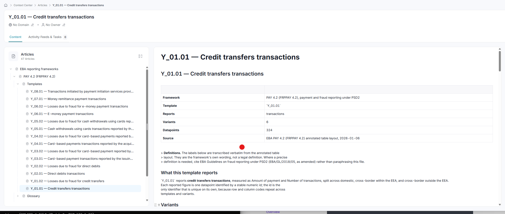
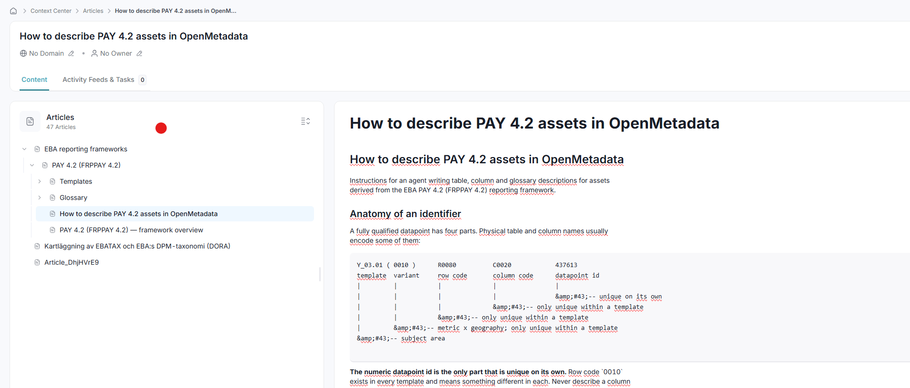

# om-eba-annotatedtpl

The EBA **PAY 4.2 (FRPPAY 4.2)** annotated table layout — payment and fraud reporting
under PSD2 — normalised from a 55-sheet spreadsheet into documentation an agent can use
when describing tables, columns and glossary terms in OpenMetadata.

**1830 datapoints · 14 templates · 14 dimensions over
4 domains · 54 controlled values.**



## What is in here

| File | What it is | Read it when |
|---|---|---|
| `01-framework.md` | What PAY 4.2 is, the 14 templates, the shape of the data | You need orientation |
| `02-agent-instructions.md` | How to decode an identifier and write a description | **Start here** |
| `07-agent-prompt.md` | The stanza to paste into an agent's system prompt, covering every framework | You are configuring an agent |
| `describe_table.py` | Writes descriptions and glossary terms onto a table's columns, by name | You are describing a real table |
| `pay42_lookup.py` | Deterministic datapoint lookup over DuckDB, and its tool definition | You are giving an agent a lookup tool |
| `agent_tools.py` | All four tool definitions and one dispatcher | You are wiring the tools into an agent |
| `display_names.py` | The rule for what a table and its columns are called | You are setting display names |
| `08-lookup-tool.md` | How to register and dispatch that tool | You are wiring it into an agent |
| `03-glossary/domains-and-members.md` | The 54 controlled values across 4 domains | You need the vocabulary |
| `03-glossary/dimensions.md` | The 14 breakdown axes | You need to know which axis a value belongs to |
| `03-glossary/metrics.md` | The 3 metrics and their units | You need the unit |
| `04-tables/<TEMPLATE>.md` | One per template: variants, columns, rows, datapoint ids | You are describing a table |
| `05-datapoints.csv` | All 1830 datapoints, keyed by `table_name` and `column_name` | You have a column to describe |
| `06-openmetadata-glossary.csv` | Bulk glossary import, 93 terms | You are loading the glossary |

## Warehouse column names

One table per template — `Y_01.01` lands in `Y_01_01` — with datapoint columns named
`Y0101_r0010_c0010`: template with its separators stripped, then row and column code.
`05-datapoints.csv` is keyed by both, as its first two fields.

Everything that does not match `^[A-Za-z][0-9]{4}_r[0-9]{4}_c[0-9]{4}$` is warehouse
context (`Period_SK`, `Company_BK`, `Taxonomy_Name`, ...) and has no framework meaning.

A column name carries no variant, so 302 of the 320 distinct names map to six datapoints
each — two metrics across three geographies — and the 18 from the `.02` loss templates
map to one. The variant is a property of the table, not the column.
`02-agent-instructions.md` has the worked example.

## Reproducing

```bash
uv sync
uv run source/extract_dpm.py    # xlsx  → source/dpm.json      (structure)
uv run source/vocab.py          # dpm   → source/vocab.json    (vocabulary)
uv run source/gen_pack.py       # both  → the markdown and CSV in this repo
```

The spreadsheet is built on merged-cell blocks: the row axis sits to the right of the
data columns, the column axis in a footer block, and the sheet axis in the header. The
merge *spans* are what identify where each block starts and ends, which is why the
extraction uses openpyxl — a plain cell reader gives you the values but not the geometry.

## Importing into OpenMetadata

```bash
export OM_HOST=https://your-host/api      # the /api suffix is required
export OM_JWT_TOKEN=...
uv run import_to_openmetadata.py --dry-run
uv run import_to_openmetadata.py --pages-only
uv run import_to_openmetadata.py --glossary-only --commit
```

| Flag | Effect |
|---|---|
| `--dry-run` | Print the page tree and stop. Contacts nothing. |
| `--pages-only` | Knowledge Pages only, skip the glossary |
| `--glossary-only` | Glossary only, skip the pages |
| `--commit` | Actually write the glossary terms. Without it, only the first pass is dry run. |
| `--reset-glossary` | **Destructive.** Hard-delete the glossary and its terms first. |
| `--verify` | Compare the database listing with the search-index listing, then stop |
| `--no-reindex` | Do not reindex after writing pages |

Markdown goes to Knowledge Pages (`PUT /v1/contextCenter/pages`) under an `EBA` root, so
a later framework can be loaded beside this one:

    EBA
    └── PAY 4.2 (FRPPAY 4.2)
        ├── Framework
        ├── Agent instructions
        ├── Agent prompt
        ├── Glossary      (dimensions, domains and members, metrics)
        └── Templates     (one page per template)

There is no bulk file upload and no document library — `docStore/document.json` is a
generic JSON payload store the UI uses for persona layouts.



### The glossary import runs in passes

The CSV holds glossary **terms**; it does not create the glossary, so the importer does
that first. Then it sends the terms one level at a time.

A term's parent is resolved against the database, and a dry run persists nothing, so a
term whose parent sits in the same file can never validate — on a freshly created, empty
glossary the import answers `Entity not found: glossaryTerm <uuid>`, naming a reference
that only ever existed in memory. The passes are therefore:

| Pass | Terms | |
|---|---|---|
| 1 | 3 | `Domains`, `Dimensions`, `Metrics` |
| 2 | 21 | the domains, dimensions and metrics themselves |
| 3 | 54 | the members |
| 4 | 14 | the rows carrying `relatedTerms`, which point from a dimension to a domain on the same level |

Each pass is dry run and then committed before the next begins, so **without `--commit`
only the first pass can be checked** — the later ones have nothing to resolve against yet.

Terms are created as `Draft` except the three grouping terms. Promote them once a domain
expert has checked the definitions: the descriptions here are structural, they say where
a term is used, not what it legally means.

### Doing it by hand

```bash
AUTH="Authorization: Bearer $OM_JWT_TOKEN"

curl -X POST "$OM_HOST/v1/glossaries" -H "$AUTH" -H 'Content-Type: application/json' -d '{"name": "PAY_4_2", "displayName": "PAY 4.2 (FRPPAY 4.2)", "description": "..."}'

curl -X PUT "$OM_HOST/v1/glossaries/name/PAY_4_2/import?dryRun=true" -H "$AUTH" -H 'Content-Type: text/plain' --data-binary @06-openmetadata-glossary.csv
```

The second call imports the whole file at once and **will fail** for the reason above;
split it by level first, or use the script. The header comes from
`json/data/glossary/glossaryCsvDocumentation.json` in the OpenMetadata source:
`parent, name*, displayName, description, synonyms, relatedTerms, references, tags,
reviewers, owner, glossaryStatus, color, iconURL, domains, extension`. Check it against
your own instance — `GET /v1/glossaries/documentation/csv` returns what your server
expects. An empty `parent` puts a term directly under the glossary.

The glossary is named `PAY_4_2`, not `PAY 4.2`, and carries the readable form in its
displayName. OpenMetadata quotes any FQN part containing a dot, so a glossary called
`PAY 4.2` is addressed as `"PAY 4.2".Domains`; a parent column written `PAY 4.2.Domains`
then matches nothing and every child row fails with `Entity ... not found`.

`Payment related parties` appears twice, once as a domain and once as a dimension. That
is deliberate — dimension `qKKL` carries the same label as its domain `qRP` — and the two
have different parents, so the FQNs do not collide.

## Troubleshooting

### A re-run does not change a page

`EntityRepository.updateDescription` reverts a PUT that would replace a non-empty
description when the caller is a **bot**, and answers 200 as if it had worked. A second
import from a bot token therefore leaves the old text in place while every line prints a
tick. The importer detects this and falls back to PATCH, which the server's own comment
names as the way round it; if that is refused too, the run ends by naming the pages that
kept their old body. Use a user token, or delete the pages so they are created fresh.

### Pages written but missing from the list

The UI lists pages through `/search/hierarchy`, which reads the search index, while the
write goes to the database. Indexing is asynchronous, so a fresh import can be invisible
in every list view. The importer reindexes the ids it wrote; `--verify` shows the two
counts side by side.

### The diagrams or quotes look wrong

Descriptions are sanitised on write by an OWASP HTML policy, which HTML-escapes as it
goes: a plus sign comes back as a numeric character reference, and a greater-than sign as
`&gt;`. ASCII tree connectors and markdown blockquotes do not survive. The generator
draws with box characters, uses fenced blocks instead of quotes, and fails the build if a
plus sign reaches any page.

## Licence

The code is MIT (see `LICENSE`). The PAY 4.2 content — codes, labels, datapoint ids,
structure and the source workbook — is EBA material, reproduced under the EBA legal
notice, which authorises reproduction provided the source is acknowledged. That is a
permission with an attribution condition, not a named open licence, and the MIT licence
does not extend to it. See `NOTICE`. Not affiliated with or endorsed by the EBA.

## The one thing to get right

Row code `0010` and column code `0010` exist in every template and mean something
different in each. Only the numeric **datapoint id** is unique on its own. Resolve to a
datapoint id before writing any description.
