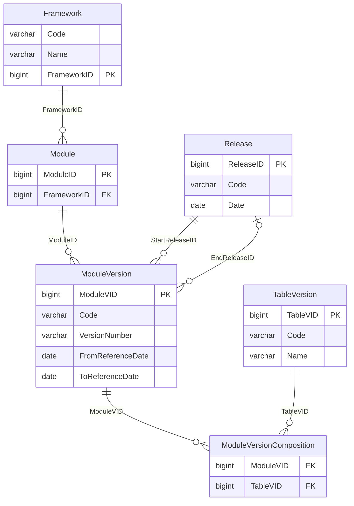
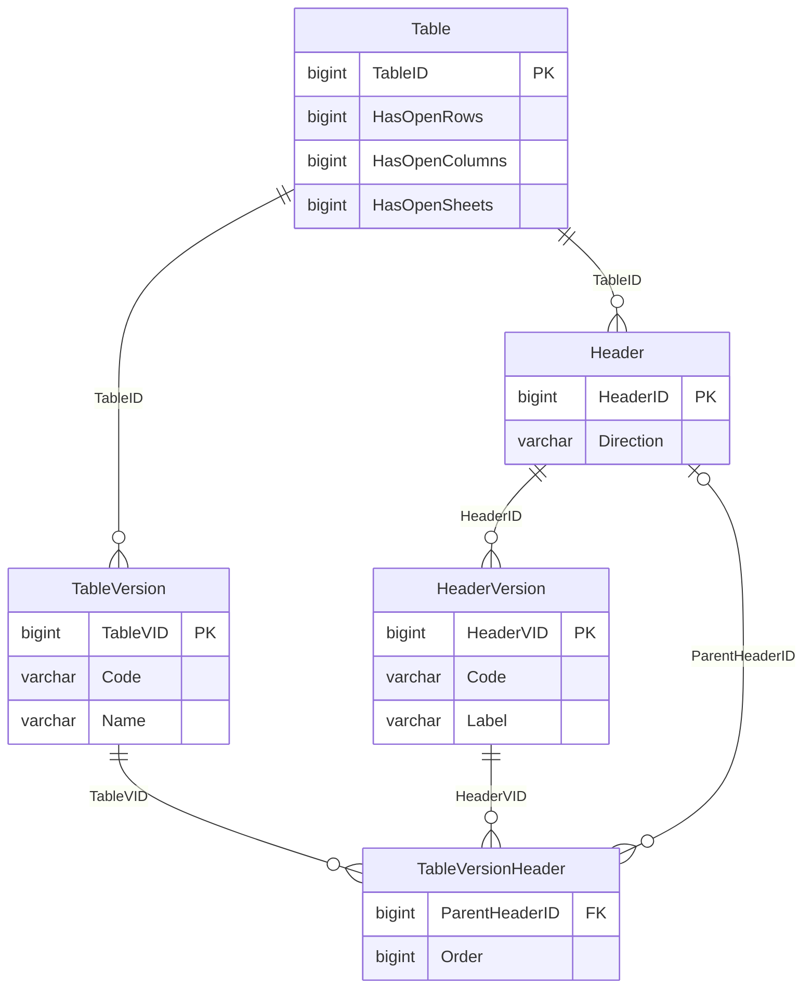
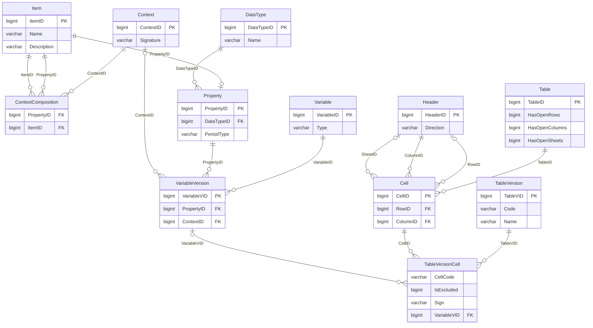
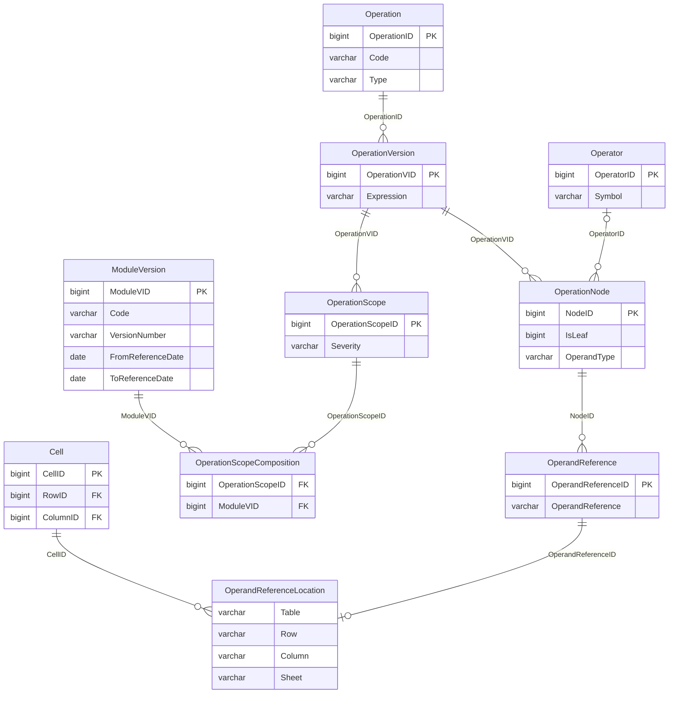

# The DPM 2.0 database, locally

Release **4.2.1** (2026-02-15) of the EBA DPM 2.0 database, loaded into DuckDB: 73 tables,
5,728,777 rows, 138 MB. It is the model the pack is built from, which the annotated table
layout only renders.

```bash
uv run source/fetch_dpm2.py          # download, unpack, load  (needs mdbtools)
uv run source/check_against_dpm2.py  # does the pack match it, cell for cell?
uv run source/extract_rules.py       # the validation rules, into 09-validation-rules.csv
uv run source/gen_dpm2_doc.py        # this file
duckdb source/dpm2/dpm2.duckdb       # or just poke at it
```

Nothing has to be configured. `DPM2_DIR` moves the whole download directory and
`DPM2_DB` the database alone; the database defaults to `dpm2.duckdb` inside `DPM2_DIR`,
which defaults to `source/dpm2/` and is gitignored. Note that both are read with
`os.environ` and so, unlike `PAY42_*` and `OM_*`, are **not** read from a `.env` file.

The Access export carries no foreign keys, so every relationship drawn below was measured
against the data instead: all 36 hold with no orphaned key, and the generator fails rather
than draw one that does not. The cardinality is measured too, not assumed:

- `||` on the parent side means every child has a parent; `|o` means the child key is
  nullable, so it may have none.
- `o{` on the child side means a parent may have any number of children; `o|` means the
  child key is unique in its own table, so a parent has at most one.

`Item ||--o| Property` therefore says what it means: a property is an item, and an item is
a property at most once.

## Reading a version number

Almost everything is versioned, and the two ids are easy to confuse:

- `TableID` is the template. `TableVID` is the template **as it stood in some release**.
- `ModuleID` / `ModuleVID`, `HeaderID` / `HeaderVID`, `VariableID` / `VariableVID`,
  `OperationID` / `OperationVID` all work the same way.

A query that forgets this gets every historical version at once, which is the single
most common way to get a wrong answer out of this database - and the wrong answer looks
like a right one, just with more rows. `Y_01.01` has 39 rows in PSD_FRP 1.1.0 and
answers 117 if you join `TableVersion` on `Code` alone.

`ModuleVersionComposition` is the join that pins a template version to the module version
that reports it, and almost every query below starts from it.

## What is reported, and when

Frameworks hold modules, a module is reissued as a version per release, and a version
lists the templates it reports. Everything else hangs off a `ModuleVID`.



| Relationship | What it means |
|---|---|
| `Module.FrameworkID` to `Framework.FrameworkID` | a framework groups its modules |
| `ModuleVersion.ModuleID` to `Module.ModuleID` | one version per release of a module |
| `ModuleVersion.StartReleaseID` to `Release.ReleaseID` | first release this version appears in |
| `ModuleVersion.EndReleaseID` to `Release.ReleaseID` | last one; null means current |
| `ModuleVersionComposition.ModuleVID` to `ModuleVersion.ModuleVID` | which templates a version reports |
| `ModuleVersionComposition.TableVID` to `TableVersion.TableVID` | and at which version of each |

## The grid of a template

A template is versioned, and so is every entry on its axes. `Direction` is `X` for a
column, `Y` for a row and `Z` for a sheet; `ParentHeaderID` is what makes an "Of which"
row a child of the row it qualifies.



| Relationship | What it means |
|---|---|
| `TableVersion.TableID` to `Table.TableID` | a template's versions |
| `Header.TableID` to `Table.TableID` | the template's axis entries |
| `HeaderVersion.HeaderID` to `Header.HeaderID` | a header's code and label per release |
| `TableVersionHeader.TableVID` to `TableVersion.TableVID` | which headers this version uses |
| `TableVersionHeader.HeaderVID` to `HeaderVersion.HeaderVID` | and with which label |
| `TableVersionHeader.ParentHeaderID` to `Header.HeaderID` | what an 'Of which' row qualifies |

## What a cell means

A cell is a position; what it reports is a variable, and a variable is one metric
measured under one context. A context is a set of dimension-and-member pairs, and both
sides of that pair are rows of `Item`.



| Relationship | What it means |
|---|---|
| `TableVersionCell.TableVID` to `TableVersion.TableVID` | the cells of a template version |
| `TableVersionCell.CellID` to `Cell.CellID` | the cell's position |
| `TableVersionCell.VariableVID` to `VariableVersion.VariableVID` | what it reports; null if excluded |
| `Cell.TableID` to `Table.TableID` | the template it sits in |
| `Cell.RowID` to `Header.HeaderID` | its row; null on an open row axis |
| `Cell.ColumnID` to `Header.HeaderID` | its column |
| `Cell.SheetID` to `Header.HeaderID` | its sheet; null where there is no sheet axis |
| `VariableVersion.VariableID` to `Variable.VariableID` | the variable's versions |
| `VariableVersion.PropertyID` to `Property.PropertyID` | the metric being measured |
| `VariableVersion.ContextID` to `Context.ContextID` | the breakdown it is measured under |
| `ContextComposition.ContextID` to `Context.ContextID` | a context is a set of these |
| `ContextComposition.PropertyID` to `Item.ItemID` | the dimension |
| `ContextComposition.ItemID` to `Item.ItemID` | the member of it |
| `Property.PropertyID` to `Item.ItemID` | a property is an item that can be measured |
| `Property.DataTypeID` to `DataType.DataTypeID` | monetary, count, date, ... |

## Validation rules

A rule code is versioned, scoped to module versions with a severity, and stored as an
expression tree. The leaves are resolved to actual cells in `OperandReferenceLocation`,
which is why nothing has to parse DPM-XL.



| Relationship | What it means |
|---|---|
| `OperationVersion.OperationID` to `Operation.OperationID` | a rule code's versions |
| `OperationScope.OperationVID` to `OperationVersion.OperationVID` | severity and from when |
| `OperationScopeComposition.OperationScopeID` to `OperationScope.OperationScopeID` | scoped to |
| `OperationScopeComposition.ModuleVID` to `ModuleVersion.ModuleVID` | a module version |
| `OperationNode.OperationVID` to `OperationVersion.OperationVID` | the expression as a tree |
| `OperationNode.OperatorID` to `Operator.OperatorID` | null on a leaf |
| `OperandReference.NodeID` to `OperationNode.NodeID` | what a leaf refers to |
| `OperandReferenceLocation.OperandReferenceID` to `OperandReference.OperandReferenceID` | resolved to |
| `OperandReferenceLocation.CellID` to `Cell.CellID` | the actual cells |

## Things that will trip you up

**An excluded cell has no variable.** `IsExcluded` is set on 80,149 cells and
`VariableVID` is null on 80,149 - the same cells, checked rather than assumed. An excluded
cell is a greyed-out box in the template: in the dictionary, with no variable, nothing to
report. The pack leaves them out, which is why it has 324 columns for `Y_01.01` where the
model has 396 cells.

**A rule code is not one rule.** The same `Operation.Code` is reissued per module version,
and both the expression and the severity change between them: `v09247_s` is a `warning` in
PSD_FRP 1.1.0 and an `error` in 1.2.0. Always carry the module version alongside the code.

**A template code has four spellings.** The model writes `Y_01.01`. The annotated layout
and the warehouse's `BA_Form_Cell` write `Y 01.01`. The warehouse table is `Y_01_01` and
the column prefix is `Y0101`. They are one template.

**143 of 1052 templates have no rows, columns or cells** in their newest version. That is a
fact about the dictionary, not about the report - do not read it as "this template has no
columns".

**There are almost no published definitions.** 1,453 of 14,551 items carry a `Description`, and
none of them belong to PSD_FRP, the fraud-reporting module this pack describes. The eight
that do show up under framework PAY belong to SEPA_IPR. So the pack's own glossary is not
duplicating anything upstream, and there is nothing here to harvest for it.

**Case varies in free-text fields.** `Property.PeriodType` holds both `Stock` and `stock`.
Lower-case before grouping on anything that is not a code.

## Example queries

Every one of these was run against release 4.2.1.

### Which module versions a framework has

```sql
SELECT   mv.ModuleVID, mv.Code, mv.Name, mv.VersionNumber,
         mv.FromReferenceDate, mv.ToReferenceDate
FROM     ModuleVersion mv
JOIN     Module m USING (ModuleID)
JOIN     Framework f ON f.FrameworkID = m.FrameworkID
WHERE    f.Code = 'PAY'
ORDER BY mv.Code, mv.VersionNumber;
```

`ToReferenceDate` null is the current one. This is where you discover that the module
version you are describing has a successor.

### The templates in one module version

```sql
SELECT   tv.TableVID, tv.Code, tv.Name
FROM     ModuleVersionComposition mvc
JOIN     TableVersion tv USING (TableVID)
JOIN     ModuleVersion mv USING (ModuleVID)
WHERE    mv.Code = 'PSD_FRP' AND mv.VersionNumber = '1.1.0'
ORDER BY tv.Code;
```

### How many cells a template has, and how many are reportable

```sql
SELECT   tv.Code,
         count(*)                                   AS cells,
         count(*) FILTER (WHERE c.IsExcluded <> 0)   AS excluded
FROM     ModuleVersionComposition mvc
JOIN     TableVersion tv USING (TableVID)
JOIN     TableVersionCell c ON c.TableVID = tv.TableVID
JOIN     ModuleVersion mv USING (ModuleVID)
WHERE    mv.Code = 'PSD_FRP' AND mv.VersionNumber = '1.1.0'
GROUP BY tv.Code
ORDER BY tv.Code;
```

`Y_01.01` answers 396 cells, 72 excluded. The pack has 324 columns for it.

### The rows of a template, with their nesting

```sql
SELECT   hv.Code, hv.Label, parent.Code AS parent_code
FROM     ModuleVersionComposition mvc
JOIN     ModuleVersion mv USING (ModuleVID)
JOIN     TableVersion tv USING (TableVID)
JOIN     TableVersionHeader tvh ON tvh.TableVID = tv.TableVID
JOIN     HeaderVersion hv ON hv.HeaderVID = tvh.HeaderVID
JOIN     Header h ON h.HeaderID = tvh.HeaderID
LEFT JOIN TableVersionHeader ptvh
       ON ptvh.TableVID = tvh.TableVID AND ptvh.HeaderID = tvh.ParentHeaderID
LEFT JOIN HeaderVersion parent ON parent.HeaderVID = ptvh.HeaderVID
WHERE    mv.Code = 'PSD_FRP' AND mv.VersionNumber = '1.1.0'
  AND    tv.Code = 'Y_01.01' AND h.Direction = 'Y'
ORDER BY tvh."Order";
```

`Direction` is `Y` for rows, `X` for columns, `Z` for sheets. The sheet axis is where
PAY's six metric-and-geography variants live.

Note the two lines pinning the module version. Joining `TableVersion` on `Code` alone
answers 117 rows here instead of 39, because `Y_01.01` has three versions and you asked
for all of them. This is the mistake the section at the top is about, and it does not
announce itself - the extra rows look like real rows.

### What one cell measures

```sql
SELECT DISTINCT dimension.Name AS dimension, member.Name AS member
FROM     ModuleVersionComposition mvc
JOIN     ModuleVersion mv USING (ModuleVID)
JOIN     TableVersionCell c ON c.TableVID = mvc.TableVID
JOIN     VariableVersion vv USING (VariableVID)
JOIN     ContextComposition cc ON cc.ContextID = vv.ContextID
JOIN     Item member    ON member.ItemID = cc.ItemID
JOIN     Item dimension ON dimension.ItemID = cc.PropertyID
WHERE    mv.Code = 'PSD_FRP' AND mv.VersionNumber = '1.1.0'
  AND    c.CellCode = '{Y_01.01, r0010, c0010, s0010}'
ORDER BY 1;
```

Three dimensions for this cell. Drop the module version and it answers five, because the
older and newer versions of the template break it down differently - and nothing in the
result says which rows came from which. `DISTINCT` is still needed on top: one cell
resolves through several variable versions even within one module version.

### Its data type and period type

```sql
SELECT DISTINCT dt.Name AS data_type, lower(p.PeriodType) AS period_type
FROM     ModuleVersionComposition mvc
JOIN     ModuleVersion mv USING (ModuleVID)
JOIN     TableVersionCell c ON c.TableVID = mvc.TableVID
JOIN     VariableVersion vv USING (VariableVID)
JOIN     Property p ON p.PropertyID = vv.PropertyID
LEFT JOIN DataType dt ON dt.DataTypeID = p.DataTypeID
WHERE    mv.Code = 'PSD_FRP' AND mv.VersionNumber = '1.1.0'
  AND    c.CellCode = '{Y_01.01, r0010, c0010, s0010}';
```

`lower()` because `PeriodType` holds both `Stock` and `stock`, and without it one cell
answers two rows that differ only in case.

### The validation rules in scope for a module version

```sql
SELECT   o.Code, os.Severity, ov.Expression
FROM     OperationScopeComposition osc
JOIN     OperationScope os USING (OperationScopeID)
JOIN     OperationVersion ov ON ov.OperationVID = os.OperationVID
JOIN     Operation o ON o.OperationID = ov.OperationID
JOIN     ModuleVersion mv USING (ModuleVID)
WHERE    mv.Code = 'PSD_FRP' AND mv.VersionNumber = '1.1.0'
ORDER BY o.Code;
```

114 rules for PSD_FRP 1.1.0, 71 for DORA 1.1.0. An expression reads
`with {tY_01.01, c*, s*, default: 0, interval: true}: {r0020} <= {r0010}`.

### Which cells a rule actually constrains

This is the query that makes the rules usable, and the reason nothing in this pack parses
DPM-XL. The model has already resolved its own operands:

```sql
SELECT DISTINCT l."Table", l."Row", l."Column", l.Sheet
FROM     Operation o
JOIN     OperationVersion ov ON ov.OperationID = o.OperationID
JOIN     OperationNode n ON n.OperationVID = ov.OperationVID
JOIN     OperandReference r ON r.NodeID = n.NodeID
JOIN     OperandReferenceLocation l ON l.OperandReferenceID = r.OperandReferenceID
WHERE    o.Code = 'v09123_m'
ORDER BY 1, 2, 3, 4;
```

Turn it around - every rule that reaches one cell - and you have what
`09-validation-rules.csv` holds.

### Which rows add up to which

The expression is stored as a tree, so the arithmetic is readable without parsing the
DPM-XL string at all. An equality's two sides are its children; the side that is a single
leaf is the total, and the leaves under the addition are its terms. Additions nest to the
left, so `a + b + c` is two `+` nodes and the descent has to be recursive.

```sql
WITH RECURSIVE scoped AS (                 -- the rules in force for one module version
    SELECT op.Code AS rule_code, ov.OperationVID
    FROM   Operation op
    JOIN   OperationVersion ov           ON ov.OperationID = op.OperationID
    JOIN   OperationScope os             ON os.OperationVID = ov.OperationVID
    JOIN   OperationScopeComposition osc ON osc.OperationScopeID = os.OperationScopeID
    JOIN   ModuleVersion mv              ON mv.ModuleVID = osc.ModuleVID
    WHERE  mv.Code = 'FINREP9' AND mv.VersionNumber = '3.3.0'
), node AS (                               -- every node of those rules, with its operator
    SELECT s.rule_code, n.NodeID, n.ParentNodeID, n.IsLeaf, o.Symbol
    FROM   scoped s
    JOIN   OperationNode n ON n.OperationVID = s.OperationVID
    LEFT JOIN Operator o   ON o.OperatorID = n.OperatorID
), child AS (                              -- the two sides of an equality at the root
    SELECT r.NodeID AS eq, c.NodeID, c.Symbol, c.IsLeaf
    FROM   node r
    JOIN   node c ON c.ParentNodeID = r.NodeID
    WHERE  r.ParentNodeID IS NULL AND r.Symbol = '='
), descend AS (                            -- everything under the addition side
    SELECT eq, NodeID AS node, IsLeaf FROM child WHERE Symbol = '+'
    UNION ALL
    SELECT d.eq, n.NodeID, n.IsLeaf
    FROM   descend d JOIN node n ON n.ParentNodeID = d.node
), cells AS (                              -- a node, resolved to the cells it names
    SELECT r.NodeID, l."Table" AS tbl, coalesce(l."Row", '*') AS row_code,
           coalesce(l."Column", '*') AS col, coalesce(l.Sheet, '') AS sheet
    FROM   OperandReference r
    JOIN   OperandReferenceLocation l USING (OperandReferenceID)
)
SELECT   t.rule_code, tc.row_code AS total_row,
         list_sort(list(DISTINCT ac.row_code))              AS addend_rows,
         string_agg(DISTINCT tc.col, ', ' ORDER BY tc.col)  AS applies_to_columns
FROM     child eqs
JOIN     node t    ON t.NodeID = eqs.NodeID AND eqs.IsLeaf <> 0
JOIN     cells tc  ON tc.NodeID = t.NodeID
JOIN     descend a ON a.eq = eqs.eq AND a.IsLeaf <> 0
JOIN     cells ac  ON ac.NodeID = a.node
                  AND ac.tbl = tc.tbl AND ac.col = tc.col AND ac.sheet = tc.sheet
WHERE    tc.tbl = 'F_12.01.a'
GROUP BY t.rule_code, tc.row_code
ORDER BY tc.row_code, t.rule_code;
```

For `F_12.01.a`, Movements in allowances and provisions for credit losses (I):

| rule_code | total_row | addend_rows | applies_to_columns |
|---|---|---|---|
| v23845_h | 0010 | 0020, 0080 | all 12 |
| v23846_h | 0180 | 0190, 0250 | all 12 |
| v23847_h | 0360 | 0370, 0430 | all 12 |
| v09604_m | 0520 | 0010, 0180, 0360 | 0020 only |
| v5051_m | 0520 | 0010, 0180, 0360, 0600 | the other 11 |
| v23848_h | 0600 | 0610, 0670 | the other 11 |

Each stage splits into debt securities and loans, and the stages add to the total. Note
the two rules for row 0520: in column 0020, Increases due to origination and acquisition,
the POCI row 0600 is not part of the total. The model records that it is so; why is a
question for the ITS instructions, not for the dictionary.

Three things the query has to get right. The descent is recursive because additions nest.
The total is identified by being a leaf rather than by being on the right, so both
`{r0040} = {r0050} + {r0230}` and `{r0170} ... = {r0110}` come out correctly. And the join
between a total and its terms binds table, column and sheet - without that, a total pairs
with terms in other columns and the count explodes, and the two rules for row 0520 look
like one contradictory rule.

Across PSD_FRP 1.1.0 this answers 596 sums from 93 of its 114 rules, over 408 distinct
total cells. DORA answers none: its 71 rules are presence and comparison checks, not
arithmetic.

A rule carries no readable name to borrow instead. `OperationVersion.Description` is
populated for most versions, but it restates the expression - `{r0520} = {r0010} +
{r0180} + {r0360}` - or holds a status word like `Deactivated`, and for the four
hierarchy rules of `F_12.01.a` it is null. The prose has to be built, and the axis labels
are what to build it from: join the headers back on, `Direction = 'Y'` for rows and
`'X'` for columns.

```sql
WITH RECURSIVE scoped AS (
    SELECT op.Code AS rule_code, ov.OperationVID
    FROM   Operation op
    JOIN   OperationVersion ov           ON ov.OperationID = op.OperationID
    JOIN   OperationScope os             ON os.OperationVID = ov.OperationVID
    JOIN   OperationScopeComposition osc ON osc.OperationScopeID = os.OperationScopeID
    JOIN   ModuleVersion mv              ON mv.ModuleVID = osc.ModuleVID
    WHERE  mv.Code = 'FINREP9' AND mv.VersionNumber = '3.3.0'
), node AS (
    SELECT s.rule_code, n.NodeID, n.ParentNodeID, n.IsLeaf, o.Symbol
    FROM   scoped s JOIN OperationNode n ON n.OperationVID = s.OperationVID
    LEFT JOIN Operator o ON o.OperatorID = n.OperatorID
), child AS (
    SELECT r.NodeID AS eq, c.NodeID, c.Symbol, c.IsLeaf
    FROM   node r JOIN node c ON c.ParentNodeID = r.NodeID
    WHERE  r.ParentNodeID IS NULL AND r.Symbol = '='
), descend AS (
    SELECT eq, NodeID AS node, IsLeaf FROM child WHERE Symbol = '+'
    UNION ALL
    SELECT d.eq, n.NodeID, n.IsLeaf FROM descend d JOIN node n ON n.ParentNodeID = d.node
), cells AS (
    SELECT r.NodeID, l."Table" AS tbl, coalesce(l."Row",'*') AS row_code,
           coalesce(l."Column",'*') AS col, coalesce(l.Sheet,'') AS sheet
    FROM   OperandReference r JOIN OperandReferenceLocation l USING (OperandReferenceID)
), label AS (
    SELECT h.Direction, hv.Code, hv.Label
    FROM   ModuleVersionComposition mvc
    JOIN   TableVersion tv USING (TableVID)
    JOIN   ModuleVersion mv USING (ModuleVID)
    JOIN   TableVersionHeader tvh ON tvh.TableVID = tv.TableVID
    JOIN   HeaderVersion hv ON hv.HeaderVID = tvh.HeaderVID
    JOIN   Header h ON h.HeaderID = tvh.HeaderID
    WHERE  tv.Code = 'F_12.01.a' AND mv.Code = 'FINREP9' AND mv.VersionNumber = '3.3.0'
)
SELECT   t.rule_code,
         tc.row_code || '  ' || tl.Label                           AS total,
         list_sort(list(DISTINCT ac.row_code || '  ' || al.Label)) AS addends,
         list_sort(list(DISTINCT tc.col || '  ' || cl.Label))      AS columns
FROM     child eqs
JOIN     node t    ON t.NodeID = eqs.NodeID AND eqs.IsLeaf <> 0
JOIN     cells tc  ON tc.NodeID = t.NodeID
JOIN     descend a ON a.eq = eqs.eq AND a.IsLeaf <> 0
JOIN     cells ac  ON ac.NodeID = a.node
                  AND ac.tbl = tc.tbl AND ac.col = tc.col AND ac.sheet = tc.sheet
JOIN     label tl ON tl.Direction = 'Y' AND tl.Code = tc.row_code
JOIN     label al ON al.Direction = 'Y' AND al.Code = ac.row_code
JOIN     label cl ON cl.Direction = 'X' AND cl.Code = tc.col
WHERE    tc.tbl = 'F_12.01.a'
GROUP BY t.rule_code, tc.row_code, tl.Label
ORDER BY tc.row_code, t.rule_code;
```

Which turns the nuance about row 0520 into something a reader can act on:

```
rule_code = v09604_m
    total = 0520  Total allowance for debt instruments
  addends = [0010  Allowances for financial assets without increase in credit risk (Stage 1),
             0180  Allowances for debt instruments with significant increase in credit risk (Stage 2),
             0360  Allowances for credit-impaired debt instruments (Stage 3)]
  columns = [0020  Increases due to origination and acquisition]
```

### The whole breakdown, not one level of it

A total's terms are often totals themselves, so the sums form a tree. Descending it
needs a second recursion on top of the first - one over the expression tree, one over
the totals - and both fit in a single statement.

```sql
WITH RECURSIVE scoped AS (
    SELECT op.Code AS rule_code, ov.OperationVID
    FROM   Operation op
    JOIN   OperationVersion ov           ON ov.OperationID = op.OperationID
    JOIN   OperationScope os             ON os.OperationVID = ov.OperationVID
    JOIN   OperationScopeComposition osc ON osc.OperationScopeID = os.OperationScopeID
    JOIN   ModuleVersion mv              ON mv.ModuleVID = osc.ModuleVID
    WHERE  mv.Code = 'FINREP9' AND mv.VersionNumber = '3.3.0'
), node AS (
    SELECT s.rule_code, n.NodeID, n.ParentNodeID, n.IsLeaf, o.Symbol
    FROM   scoped s JOIN OperationNode n ON n.OperationVID = s.OperationVID
    LEFT JOIN Operator o ON o.OperatorID = n.OperatorID
), child AS (
    SELECT r.NodeID AS eq, c.NodeID, c.Symbol, c.IsLeaf
    FROM   node r JOIN node c ON c.ParentNodeID = r.NodeID
    WHERE  r.ParentNodeID IS NULL AND r.Symbol = '='
), addends AS (
    SELECT eq, NodeID AS node, IsLeaf FROM child WHERE Symbol = '+'
    UNION ALL
    SELECT a.eq, n.NodeID, n.IsLeaf FROM addends a JOIN node n ON n.ParentNodeID = a.node
), cells AS (
    SELECT r.NodeID, l."Table" AS tbl, coalesce(l."Row",'*') AS row_code,
           coalesce(l."Column",'*') AS col, coalesce(l.Sheet,'') AS sheet
    FROM   OperandReference r JOIN OperandReferenceLocation l USING (OperandReferenceID)
-- One row per total, addend and the rule saying so, for one column of one template.
), edge AS (
    SELECT DISTINCT t.rule_code, tc.row_code AS parent, ac.row_code AS child
    FROM     child eqs
    JOIN     node t    ON t.NodeID = eqs.NodeID AND eqs.IsLeaf <> 0
    JOIN     cells tc  ON tc.NodeID = t.NodeID
    JOIN     addends a ON a.eq = eqs.eq AND a.IsLeaf <> 0
    JOIN     cells ac  ON ac.NodeID = a.node
                      AND ac.tbl = tc.tbl AND ac.col = tc.col AND ac.sheet = tc.sheet
    WHERE    tc.tbl = 'F_12.01.a' AND tc.col = '0010' AND tc.sheet = ''
), root AS (
    SELECT DISTINCT parent FROM edge WHERE parent NOT IN (SELECT child FROM edge)
), tree AS (
    SELECT r.parent AS node, 0 AS level, r.parent AS path, CAST(NULL AS VARCHAR) AS via
    FROM   root r
    UNION ALL
    -- The rule belongs in the path. A total with two decompositions is two branches, and
    -- without it they collapse into rows that look like duplicates of each other.
    SELECT e.child, d.level + 1, d.path || '/' || e.rule_code || '/' || e.child, e.rule_code
    FROM   tree d JOIN edge e ON e.parent = d.node
    WHERE  d.level < 10            -- the data has no cycle; a query should not assume it
)
SELECT   level, repeat('   ', level) || node AS breakdown, via,
         node IN (SELECT parent FROM edge) AS splits_further
FROM     tree
ORDER BY path;
```

For `F_12.01.a`, column 0010:

```
level  breakdown      via         splits_further
0      0520           NULL        true
1         0010        v5051_m     true
2            0020     v23845_h    false
2            0080     v23845_h    false
1         0180        v5051_m     true
2            0190     v23846_h    false
2            0250     v23846_h    false
1         0360        v5051_m     true
2            0370     v23847_h    false
2            0430     v23847_h    false
1         0600        v5051_m     true
2            0610     v23848_h    false
2            0670     v23848_h    false
```

Three stages and POCI, each splitting into debt securities and loans. Change `tc.col`
to `0020` and the answer is ten rows rather than thirteen: **the entire POCI branch is
gone**, both row 0600 and the two beneath it, and the rule on level 1 is `v09604_m`
instead of `v5051_m`. That is the same fact the table further up reports as two rows
with one `TotalRow` and different `AddendRows`, which is easy to read past. As a tree it
is a branch that eleven columns have and the twelfth does not.

**The rule belongs in the path.** `Y_01.01` row 0040 has three decompositions - 0050 and
0230, or 0050 and 0240 and 0290, or 0060 and 0110 and 0230 - alternative roll-ups at
different granularity rather than a contradiction. Without the rule in the path those
branches collapse into rows that look like duplicates of one another: the first version
of this query answered 0050 twice at level 2, with everything under it doubled and no
way to see why. `F_12.01.a` has one rule per total per column, so there the path does
not need it - but `via` is what shows level 1 changing rule between columns.

The same in T-SQL. `STRING_SPLIT` takes a single-character separator, so the view's
`'0020, 0080'` splits on the comma and is then trimmed, and both arms of the recursion
need the same explicit `CAST` or the CTE is rejected for a type mismatch:

```tsql
WITH edge AS (
    SELECT DISTINCT
        s.RuleCode,
        s.TotalRow AS Parent,
        LTRIM(p.value) AS Child
    FROM dpm.RuleSum AS s
    CROSS APPLY STRING_SPLIT(s.AddendRows, ',') AS p
    WHERE s.ModuleCode = 'FINREP9'
        AND s.ModuleVersion = '3.3.0'
        AND s.TableCode = 'F_12.01.a'
        AND s.ColumnCode = '0010'
        AND s.SheetCode = ''
),

root AS (
    SELECT DISTINCT e.Parent
    FROM edge AS e
    WHERE e.Parent NOT IN (SELECT ec.Child FROM edge AS ec)
),

descend AS (
    SELECT
        r.Parent AS Node,
        0 AS Level,
        CAST(r.Parent AS varchar(400)) AS Path,
        CAST(NULL AS varchar(32)) AS Via
    FROM root AS r
    UNION ALL
    SELECT
        e.Child AS Node,
        d.Level + 1 AS Level,
        CAST(d.Path + '/' + e.RuleCode + '/' + e.Child AS varchar(400)) AS Path,
        CAST(e.RuleCode AS varchar(32)) AS Via
    FROM descend AS d
    INNER JOIN edge AS e ON e.Parent = d.Node
    WHERE d.Level < 10
)

SELECT
    d.Level,
    REPLICATE('   ', d.Level) + d.Node AS Breakdown,
    d.Via,
    CASE WHEN d.Node IN (SELECT e.Parent FROM edge AS e) THEN 1 ELSE 0 END AS SplitsFurther
FROM descend AS d
ORDER BY d.Path;
```

52 rows for `Y_01.01` column 0010 and 13 for `F_12.01.a`, the same on both sides. Depth
is 4 and 2, so the default limit of 100 recursion levels is not reached; a deeper
template would need `OPTION (MAXRECURSION 0)`.

## Reading a reported instance

The EBA publishes sample instances for every module, in both formats, from the reporting
framework page: `sample_instances_4.2_hotfix.zip` unpacks into `xBRL-XML.zip` and
`xBRL-CSV.zip`, and the CSV one has a file per template - `f_12.01.a.csv` among them.

The xBRL-CSV form keys each fact by a datapoint id and nothing else:

```
datapoint,factValue
dp150067,53226
dp150103,80102
```

**`dp<N>` is `VariableVersion.VariableID`.** Not `CellID`, and not `VariableVID`: of the
808 facts in `f_12.01.a.csv`, all 808 match on `VariableID` and none on either of the
others. That is the join from reported data back to the model:

```sql
SELECT DISTINCT c.CellCode, mv.Code || ' ' || mv.VersionNumber AS module
FROM   VariableVersion vv
JOIN   TableVersionCell c ON c.VariableVID = vv.VariableVID
JOIN   ModuleVersionComposition mvc ON mvc.TableVID = c.TableVID
JOIN   ModuleVersion mv ON mv.ModuleVID = mvc.ModuleVID
WHERE  vv.VariableID = 149866
ORDER  BY module;
```

`dp149866` is `{F_12.01.a, r0010, c0010}` in all five module versions that contain the
template, which is the useful part: the datapoint id is the stable identity of a reported
fact across releases, where `VariableVID` and `CellID` are not.

### The samples will fail every arithmetic rule

Do not reach for them to check a sum. The 808 values in `f_12.01.a.csv` are integers
uniformly spread between 50044 and 99883, 803 of them distinct, under the LEI
`DUMMYLEI123456789012`. They are structural samples: they exercise a parser against the
taxonomy, and none of the six sums above holds in any of the twelve columns.

That is worth stating because the failure looks like a finding. Checking it the other way
round - does the derived row and column agree with the cell's own `CellCode`? - is what
separates "the data is noise" from "the query is wrong", and it is the check to run first.

### Checking the pack against the model

```sql
ATTACH 'pay42.duckdb' AS pack (READ_ONLY);

WITH dpm AS (
    SELECT replace(c.CellCode, '_', ' ') AS cell
    FROM   ModuleVersionComposition mvc
    JOIN   TableVersionCell c ON c.TableVID = mvc.TableVID
    JOIN   ModuleVersion mv USING (ModuleVID)
    WHERE  mv.Code = 'PSD_FRP' AND mv.VersionNumber = '1.1.0' AND c.IsExcluded = 0
)
SELECT   coalesce(d.cell, p.dpm_cell_code) AS cell,
         d.cell IS NOT NULL                AS in_dpm,
         p.dpm_cell_code IS NOT NULL       AS in_pack
FROM     dpm d
FULL OUTER JOIN pack.datapoints p ON p.dpm_cell_code = d.cell
WHERE    d.cell IS NULL OR p.dpm_cell_code IS NULL;
```

Empty is the right answer, and `source/check_against_dpm2.py` is this in both directions.
Note the `replace`: the model writes `Y_01.01` where the pack writes `Y 01.01`.

### Where the published definitions are

```sql
SELECT   f.Code AS framework, count(DISTINCT i.ItemID) AS described_items
FROM     Item i
JOIN     ContextComposition cc ON cc.ItemID = i.ItemID
JOIN     VariableVersion vv ON vv.ContextID = cc.ContextID
JOIN     TableVersionCell c ON c.VariableVID = vv.VariableVID
JOIN     ModuleVersionComposition mvc ON mvc.TableVID = c.TableVID
JOIN     ModuleVersion mv USING (ModuleVID)
JOIN     Module m ON m.ModuleID = mv.ModuleID
JOIN     Framework f ON f.FrameworkID = m.FrameworkID
WHERE    i.Description IS NOT NULL AND i.Description <> ''
GROUP BY 1
ORDER BY 2 DESC;
```

COREP, PILLAR3, IF, MiCA and a few others. The eight under PAY belong to SEPA_IPR, not
to the fraud-reporting module this pack describes.

## The same questions in T-SQL

Once `source/load_to_mssql.py` has put the dictionary next to the reported figures, the
queries above need porting. The shape carries over; five constructs do not.

| DuckDB | T-SQL |
|---|---|
| `WITH RECURSIVE` | `WITH`. The keyword does not exist, and recursion stops at 100 levels unless the statement ends `OPTION (MAXRECURSION 0)` |
| `JOIN x USING (col)` | not supported at all - `INNER JOIN x ON x.col = y.col` |
| `count(*) FILTER (WHERE p)` | `SUM(CASE WHEN p THEN 1 ELSE 0 END)` |
| `list_sort(list(DISTINCT x))` | no list type. `STRING_AGG(x, ', ') WITHIN GROUP (ORDER BY x)`, and it takes no `DISTINCT`, so duplicates have to go in a derived table first |
| `max_by(TableVID, [StartReleaseID, TableVID])` | `ROW_NUMBER() OVER (PARTITION BY ... ORDER BY ...)`, filtered to 1 |

`regexp_extract` has no equivalent either.

And one that bites on the first `SELECT`: the model's column names include `Table`, `Row`,
`Column`, `Order` and `Level`, all reserved words. They are legal identifiers but need
delimiting everywhere - `[Table]`, where DuckDB took `"Table"`. A CTAS creates them
without complaint; it is every query afterwards that needs the brackets.

### The sums, as a view

Parameterised by column rather than by argument, because a view takes none: filter on
`ModuleCode` and `ModuleVersion` when you select from it.

```tsql
CREATE OR ALTER VIEW dpm.RuleSum AS
WITH scoped AS (
    SELECT
        mv.Code AS ModuleCode, mv.VersionNumber AS ModuleVersion,
        op.Code AS RuleCode, os.Severity AS Severity, ov.OperationVID AS OperationVID
    FROM dpm.Operation AS op
    INNER JOIN dpm.OperationVersion AS ov ON ov.OperationID = op.OperationID
    INNER JOIN dpm.OperationScope AS os ON os.OperationVID = ov.OperationVID
    INNER JOIN dpm.OperationScopeComposition AS osc ON osc.OperationScopeID = os.OperationScopeID
    INNER JOIN dpm.ModuleVersion AS mv ON mv.ModuleVID = osc.ModuleVID
),

node AS (
    SELECT
        s.ModuleCode, s.ModuleVersion, s.RuleCode, s.Severity,
        n.NodeID, n.ParentNodeID, n.IsLeaf, o.Symbol
    FROM scoped AS s
    INNER JOIN dpm.OperationNode AS n ON n.OperationVID = s.OperationVID
    LEFT JOIN dpm.Operator AS o ON o.OperatorID = n.OperatorID
),

child AS (
    SELECT
        r.ModuleCode, r.ModuleVersion, r.RuleCode, r.Severity,
        r.NodeID AS Eq, c.NodeID AS NodeID, c.Symbol, c.IsLeaf
    FROM node AS r
    INNER JOIN node AS c ON c.ParentNodeID = r.NodeID
    WHERE r.ParentNodeID IS NULL AND r.Symbol = '='
),

descend AS (
    SELECT Eq, NodeID AS Node, IsLeaf FROM child WHERE Symbol = '+'
    UNION ALL
    SELECT d.Eq, n.NodeID AS Node, n.IsLeaf
    FROM descend AS d
    INNER JOIN dpm.OperationNode AS n ON n.ParentNodeID = d.Node
),

cells AS (
    SELECT
        r.NodeID,
        l.[Table] AS TableCode,
        COALESCE(l.[Row], '*') AS RowCode,
        COALESCE(l.[Column], '*') AS ColumnCode,
        COALESCE(l.Sheet, '') AS SheetCode
    FROM dpm.OperandReference AS r
    INNER JOIN dpm.OperandReferenceLocation AS l ON l.OperandReferenceID = r.OperandReferenceID
),

-- DISTINCT here, so the STRING_AGG below does not need one; it cannot take one.
pair AS (
    SELECT DISTINCT
        eqs.ModuleCode, eqs.ModuleVersion, eqs.RuleCode, eqs.Severity,
        tc.TableCode, tc.ColumnCode, tc.SheetCode,
        tc.RowCode AS TotalRow, ac.RowCode AS AddendRow
    FROM child AS eqs
    INNER JOIN cells AS tc ON tc.NodeID = eqs.NodeID AND eqs.IsLeaf <> 0
    INNER JOIN descend AS a ON a.Eq = eqs.Eq AND a.IsLeaf <> 0
    INNER JOIN cells AS ac
        ON ac.NodeID = a.Node
            AND ac.TableCode = tc.TableCode
            AND ac.ColumnCode = tc.ColumnCode
            AND ac.SheetCode = tc.SheetCode
)

SELECT
    ModuleCode, ModuleVersion, RuleCode, Severity,
    TableCode, ColumnCode, SheetCode, TotalRow,
    COUNT(*) AS AddendCount,
    STRING_AGG(AddendRow, ', ') WITHIN GROUP (ORDER BY AddendRow) AS AddendRows
FROM pair
GROUP BY
    ModuleCode, ModuleVersion, RuleCode, Severity,
    TableCode, ColumnCode, SheetCode, TotalRow;
```

Which answers the F 12.01.a question as a filter rather than an edit:

```tsql
SELECT RuleCode, TotalRow, AddendRows, ColumnCode
FROM dpm.RuleSum
WHERE ModuleCode = 'FINREP9' AND ModuleVersion = '3.3.0' AND TableCode = 'F_12.01.a'
ORDER BY TotalRow, RuleCode;
```

### The other queries, ported

Templates in one module version - `USING` becomes `ON`:

```tsql
SELECT tv.TableVID, tv.Code, tv.[Name]
FROM dpm.ModuleVersionComposition AS mvc
INNER JOIN dpm.TableVersion AS tv ON tv.TableVID = mvc.TableVID
INNER JOIN dpm.ModuleVersion AS mv ON mv.ModuleVID = mvc.ModuleVID
WHERE mv.Code = 'PSD_FRP' AND mv.VersionNumber = '1.1.0'
ORDER BY tv.Code;
```

Cells per template - `FILTER` becomes a `CASE`:

```tsql
SELECT
    tv.Code,
    COUNT(*) AS Cells,
    SUM(CASE WHEN c.IsExcluded <> 0 THEN 1 ELSE 0 END) AS Excluded
FROM dpm.ModuleVersionComposition AS mvc
INNER JOIN dpm.TableVersion AS tv ON tv.TableVID = mvc.TableVID
INNER JOIN dpm.TableVersionCell AS c ON c.TableVID = tv.TableVID
INNER JOIN dpm.ModuleVersion AS mv ON mv.ModuleVID = mvc.ModuleVID
WHERE mv.Code = 'PSD_FRP' AND mv.VersionNumber = '1.1.0'
GROUP BY tv.Code
ORDER BY tv.Code;
```

What one cell measures:

```tsql
SELECT DISTINCT dimension.[Name] AS Dimension, member.[Name] AS Member
FROM dpm.ModuleVersionComposition AS mvc
INNER JOIN dpm.ModuleVersion AS mv ON mv.ModuleVID = mvc.ModuleVID
INNER JOIN dpm.TableVersionCell AS c ON c.TableVID = mvc.TableVID
INNER JOIN dpm.VariableVersion AS vv ON vv.VariableVID = c.VariableVID
INNER JOIN dpm.ContextComposition AS cc ON cc.ContextID = vv.ContextID
INNER JOIN dpm.Item AS member ON member.ItemID = cc.ItemID
INNER JOIN dpm.Item AS dimension ON dimension.ItemID = cc.PropertyID
WHERE mv.Code = 'PSD_FRP' AND mv.VersionNumber = '1.1.0'
    AND c.CellCode = '{Y_01.01, r0010, c0010, s0010}'
ORDER BY dimension.[Name], member.[Name];
```

A reported fact back to its cell, which is the reason to do any of this - note the `+`
for string concatenation where DuckDB uses `||`:

```tsql
SELECT DISTINCT c.CellCode, mv.Code + ' ' + mv.VersionNumber AS Module
FROM dpm.VariableVersion AS vv
INNER JOIN dpm.TableVersionCell AS c ON c.VariableVID = vv.VariableVID
INNER JOIN dpm.ModuleVersionComposition AS mvc ON mvc.TableVID = c.TableVID
INNER JOIN dpm.ModuleVersion AS mv ON mv.ModuleVID = mvc.ModuleVID
WHERE vv.VariableID = 149866
ORDER BY Module;
```

The newest version of each template - `max_by` becomes a window function:

```tsql
WITH ranked AS (
    SELECT
        tv.Code, tv.TableVID,
        ROW_NUMBER() OVER (
            PARTITION BY tv.Code ORDER BY tv.StartReleaseID DESC, tv.TableVID DESC
        ) AS Newest
    FROM dpm.TableVersion AS tv
)

SELECT r.Code, r.TableVID
FROM ranked AS r
WHERE r.Newest = 1
ORDER BY r.Code;
```

### What these have been checked against

Every one parses under `sqlfluff --dialect tsql` on every test run, which is a syntax
check and nothing more. Beyond that they have been **run against SQL Server 2022 in
Docker**, loaded by `source/load_to_mssql.py`, and they answer what the DuckDB versions
answer:

| Query | DuckDB | SQL Server |
|---|---:|---:|
| templates in one module version | 14 | 14 |
| cells per template | 14 | 14 |
| what one cell measures | 3 | 3 |
| a reported fact back to its cell | 5 | 5 |
| newest version of each template | 1052 | 1052 |
| `F_12.01.a` sums, at column level | 59 | 59 |

Grouped, the view reproduces the table above exactly, `v09604_m` on its single column
included. The whole load - 73 tables, 5 728 777 rows, 62 indexes - took 31 seconds
against an emulated amd64 container on arm64, so the bulk path is doing its job.

Two things only the server found, both now fixed in the loader. A DuckDB `VARCHAR` becomes
`nvarchar(max)` through CTAS, and a MAX type cannot be an index key - SQL Server answers
error 1919 and stops with the data already in place. sqlfluff parses that `CREATE INDEX`
happily, because the statement is valid and only the column type is wrong. And the
extension has to be installed for the DuckDB version in use: one installed for the CLI is
not there for the Python package.

### The collation is not a footnote

A case-insensitive collation is the default, and it changes answers rather than just
performance. `Property.PeriodType` holds both spellings, and the same query gives:

```
DuckDB         Stock   196      stock  1770
SQL Server     stock  1966
```

Measured, on a database created with `SQL_Latin1_General_CP1_CI_AS`. Every key in this
model is a string, so `GROUP BY`, `DISTINCT` and string joins can group differently on the
two sides. Check with `SELECT DATABASEPROPERTYEX('DPM2', 'Collation')` before loading, and
decide deliberately: a case-sensitive database matches DuckDB, a case-insensitive one
matches whatever else already lives in your warehouse.

One behavioural difference to expect rather than discover. Reading the attached database
*from* DuckDB, a pushed-down predicate is evaluated by SQL Server and so follows the
column's collation, not DuckDB's byte comparison. Every code in this model is a string, so
`GROUP BY`, `DISTINCT` and string joins can group differently on the two sides - most
visibly where case is the only difference, as in `Property.PeriodType` holding both
`Stock` and `stock`.

## Every table in the database

| Table | Rows | Columns | In the model above |
|---|---:|---:|---|
| `ContextComposition` | 1 731 745 | 4 | yes |
| `Concept` | 814 926 | 3 |  |
| `OperandReference` | 612 474 | 10 | yes |
| `OperandReferenceLocation` | 579 921 | 6 | yes |
| `TableVersionCell` | 394 404 | 9 | yes |
| `VariableVersion` | 294 466 | 12 | yes |
| `Aux_CellStatus` | 256 117 | 4 |  |
| `Context` | 244 997 | 4 | yes |
| `Cell` | 165 805 | 7 | yes |
| `Variable` | 146 134 | 4 | yes |
| `OperationNode` | 140 691 | 12 | yes |
| `TableVersionHeader` | 59 539 | 9 | yes |
| `HeaderVersion` | 48 519 | 11 | yes |
| `OperationScopeComposition` | 30 073 | 3 | yes |
| `OperationScope` | 29 307 | 6 | yes |
| `Header` | 23 575 | 7 | yes |
| `SubCategoryItem` | 21 140 | 8 |  |
| `OperationVersionData` | 18 717 | 5 |  |
| `OperationVersion` | 18 717 | 11 | yes |
| `ATTT2Hierarchies` | 17 864 | 11 |  |
| `ItemCategory` | 14 665 | 8 |  |
| `PSCurrentItemCategory` | 14 551 | 8 |  |
| `Item` | 14 551 | 7 | yes |
| `Operation` | 11 352 | 7 | yes |
| `PropertyCategory` | 3 171 | 5 |  |
| `PSCurrentPropertyCategory` | 3 156 | 5 |  |
| `Property` | 3 156 | 8 | yes |
| `ModuleVersionComposition` | 3 112 | 5 | yes |
| `TableVersion` | 2 449 | 12 | yes |
| `ModuleParameters` | 2 003 | 3 |  |
| `SubCategoryVersion` | 1 246 | 5 |  |
| `SubCategory` | 1 154 | 7 |  |
| `Table` | 1 066 | 9 | yes |
| `TableGroupComposition` | 961 | 6 |  |
| `KeyComposition` | 498 | 3 |  |
| `DPMAttribute` | 457 | 4 |  |
| `Aux_CellMapping` | 426 | 4 |  |
| `VariableGeneration` | 357 | 6 |  |
| `CompoundKey` | 234 | 4 |  |
| `Category` | 150 | 11 |  |
| `ModuleVersion` | 148 | 14 | yes |
| `TableGroup` | 132 | 10 |  |
| `SuperCategoryComposition` | 102 | 5 |  |
| `VarGeneration_Detail` | 86 | 23 |  |
| `CompoundItemContext` | 83 | 5 |  |
| `DPMClass` | 73 | 5 |  |
| `OperatorArgument` | 69 | 5 |  |
| `Module` | 55 | 5 | yes |
| `KeyHeaderMapping` | 44 | 4 |  |
| `TableAssociation` | 42 | 12 |  |
| `Operator` | 38 | 4 | yes |
| `Framework` | 23 | 6 | yes |
| `DataType` | 13 | 5 | yes |
| `Release` | 6 | 11 | yes |
| `RelatedConcept` | 6 | 4 |  |
| `VarGeneration_Summary` | 5 | 6 |  |
| `Organisation` | 3 | 5 |  |
| `ConceptRelation` | 3 | 3 |  |
| `Subdivision` | 0 | 9 |  |
| `SubdivisionType` | 0 | 3 |  |
| `Role` | 0 | 2 |  |
| `ModelViolations` | 0 | 27 |  |
| `Reference` | 0 | 3 |  |
| `DocumentVersion` | 0 | 6 |  |
| `ChangeLogAttribute` | 0 | 5 |  |
| `ChangeLog` | 0 | 10 |  |
| `Translation` | 0 | 6 |  |
| `User` | 0 | 3 |  |
| `UserRole` | 0 | 2 |  |
| `Document` | 0 | 6 |  |
| `OperationCodePrefix` | 0 | 4 |  |
| `VariableCalculation` | 0 | 6 |  |
| `Language` | 0 | 2 |  |

## Licence

The code that builds this is MIT. The content is EBA material, reproduced under the EBA
legal notice, which authorises reproduction provided the source is acknowledged - see
`NOTICE`. Not affiliated with or endorsed by the EBA.
