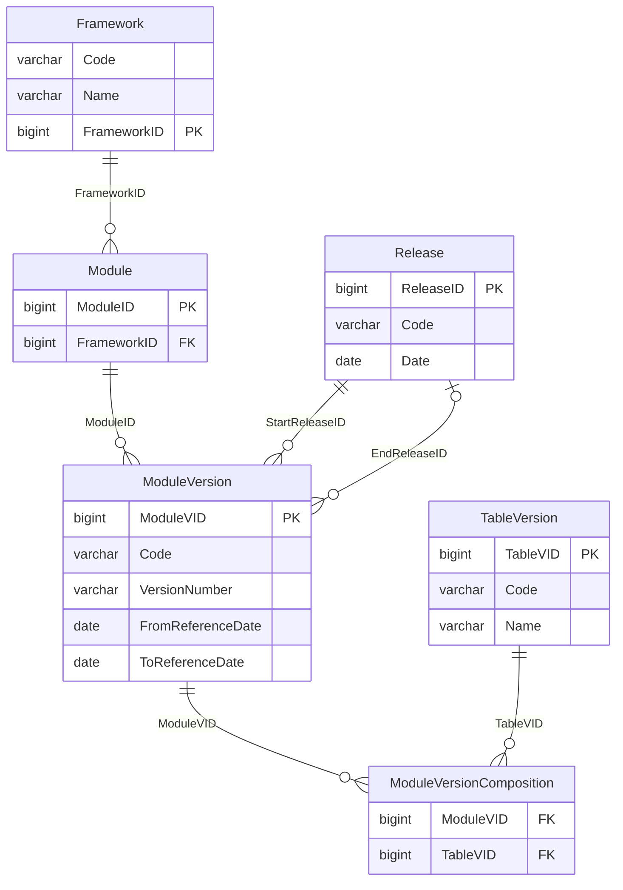
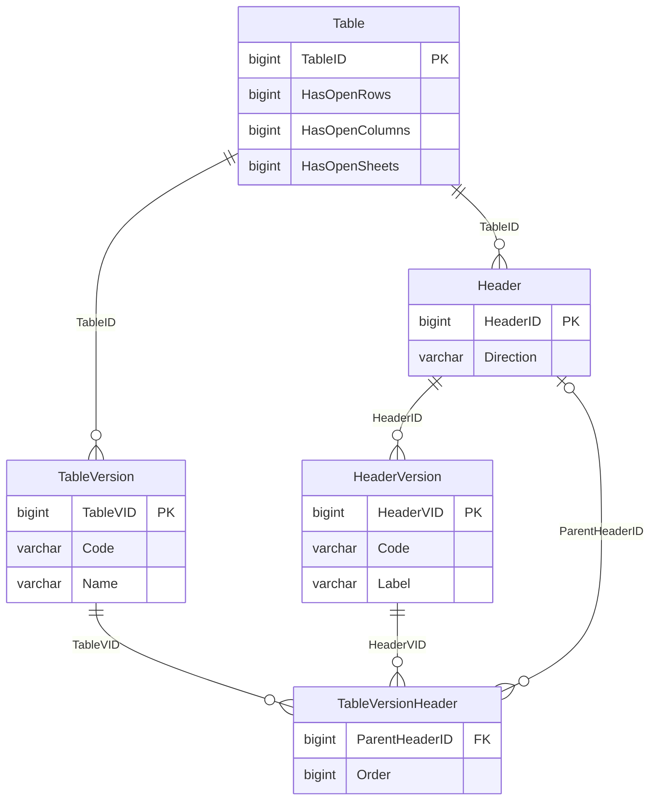
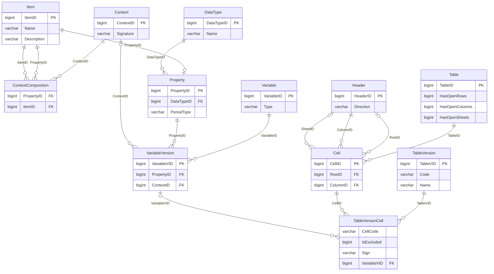
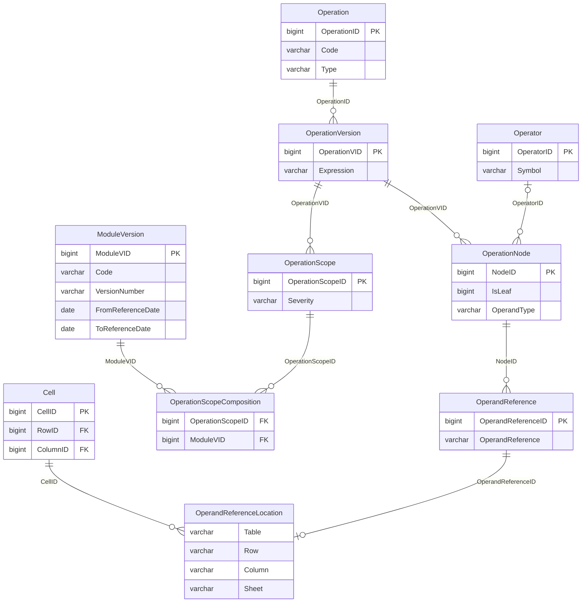

# The DPM 2.0 database, locally

Release **4.2.1** (2026-02-15) of the EBA DPM 2.0 database, loaded into DuckDB: 73 tables,
5,728,777 rows, 139 MB. It is the model the pack is built from, which the annotated table
layout only renders.

```bash
uv run source/fetch_dpm2.py          # download, unpack, load  (needs mdbtools)
uv run source/check_against_dpm2.py  # does the pack match it, cell for cell?
uv run source/extract_rules.py       # the validation rules, into 09-validation-rules.csv
uv run source/gen_dpm2_doc.py        # this file
duckdb source/dpm2/dpm2.duckdb       # or just poke at it
```

Nothing has to be configured. `DPM2_DIR` moves the whole download directory and
`DPM2_DB` the database alone; the database defaults to `dpm2.duckdb` inside `DPM2_DIR`,
which defaults to `source/dpm2/` and is gitignored. Note that both are read with
`os.environ` and so, unlike `PAY42_*` and `OM_*`, are **not** read from a `.env` file.

The Access export carries no foreign keys, so every relationship drawn below was measured
against the data instead: all 36 hold with no orphaned key, and the generator fails rather
than draw one that does not. The cardinality is measured too, not assumed:

- `||` on the parent side means every child has a parent; `|o` means the child key is
  nullable, so it may have none.
- `o{` on the child side means a parent may have any number of children; `o|` means the
  child key is unique in its own table, so a parent has at most one.

`Item ||--o| Property` therefore says what it means: a property is an item, and an item is
a property at most once.

## Reading a version number

Almost everything is versioned, and the two ids are easy to confuse:

- `TableID` is the template. `TableVID` is the template **as it stood in some release**.
- `ModuleID` / `ModuleVID`, `HeaderID` / `HeaderVID`, `VariableID` / `VariableVID`,
  `OperationID` / `OperationVID` all work the same way.

A query that forgets this gets every historical version at once, which is the single
most common way to get a wrong answer out of this database - and the wrong answer looks
like a right one, just with more rows. `Y_01.01` has 39 rows in PSD_FRP 1.1.0 and
answers 117 if you join `TableVersion` on `Code` alone.

`ModuleVersionComposition` is the join that pins a template version to the module version
that reports it, and almost every query below starts from it.

## What is reported, and when

Frameworks hold modules, a module is reissued as a version per release, and a version
lists the templates it reports. Everything else hangs off a `ModuleVID`.



| Relationship | What it means |
|---|---|
| `Module.FrameworkID` to `Framework.FrameworkID` | a framework groups its modules |
| `ModuleVersion.ModuleID` to `Module.ModuleID` | one version per release of a module |
| `ModuleVersion.StartReleaseID` to `Release.ReleaseID` | first release this version appears in |
| `ModuleVersion.EndReleaseID` to `Release.ReleaseID` | last one; null means current |
| `ModuleVersionComposition.ModuleVID` to `ModuleVersion.ModuleVID` | which templates a version reports |
| `ModuleVersionComposition.TableVID` to `TableVersion.TableVID` | and at which version of each |

## The grid of a template

A template is versioned, and so is every entry on its axes. `Direction` is `X` for a
column, `Y` for a row and `Z` for a sheet; `ParentHeaderID` is what makes an "Of which"
row a child of the row it qualifies.



| Relationship | What it means |
|---|---|
| `TableVersion.TableID` to `Table.TableID` | a template's versions |
| `Header.TableID` to `Table.TableID` | the template's axis entries |
| `HeaderVersion.HeaderID` to `Header.HeaderID` | a header's code and label per release |
| `TableVersionHeader.TableVID` to `TableVersion.TableVID` | which headers this version uses |
| `TableVersionHeader.HeaderVID` to `HeaderVersion.HeaderVID` | and with which label |
| `TableVersionHeader.ParentHeaderID` to `Header.HeaderID` | what an 'Of which' row qualifies |

## What a cell means

A cell is a position; what it reports is a variable, and a variable is one metric
measured under one context. A context is a set of dimension-and-member pairs, and both
sides of that pair are rows of `Item`.



| Relationship | What it means |
|---|---|
| `TableVersionCell.TableVID` to `TableVersion.TableVID` | the cells of a template version |
| `TableVersionCell.CellID` to `Cell.CellID` | the cell's position |
| `TableVersionCell.VariableVID` to `VariableVersion.VariableVID` | what it reports; null if excluded |
| `Cell.TableID` to `Table.TableID` | the template it sits in |
| `Cell.RowID` to `Header.HeaderID` | its row; null on an open row axis |
| `Cell.ColumnID` to `Header.HeaderID` | its column |
| `Cell.SheetID` to `Header.HeaderID` | its sheet; null where there is no sheet axis |
| `VariableVersion.VariableID` to `Variable.VariableID` | the variable's versions |
| `VariableVersion.PropertyID` to `Property.PropertyID` | the metric being measured |
| `VariableVersion.ContextID` to `Context.ContextID` | the breakdown it is measured under |
| `ContextComposition.ContextID` to `Context.ContextID` | a context is a set of these |
| `ContextComposition.PropertyID` to `Item.ItemID` | the dimension |
| `ContextComposition.ItemID` to `Item.ItemID` | the member of it |
| `Property.PropertyID` to `Item.ItemID` | a property is an item that can be measured |
| `Property.DataTypeID` to `DataType.DataTypeID` | monetary, count, date, ... |

## Validation rules

A rule code is versioned, scoped to module versions with a severity, and stored as an
expression tree. The leaves are resolved to actual cells in `OperandReferenceLocation`,
which is why nothing has to parse DPM-XL.



| Relationship | What it means |
|---|---|
| `OperationVersion.OperationID` to `Operation.OperationID` | a rule code's versions |
| `OperationScope.OperationVID` to `OperationVersion.OperationVID` | severity and from when |
| `OperationScopeComposition.OperationScopeID` to `OperationScope.OperationScopeID` | scoped to |
| `OperationScopeComposition.ModuleVID` to `ModuleVersion.ModuleVID` | a module version |
| `OperationNode.OperationVID` to `OperationVersion.OperationVID` | the expression as a tree |
| `OperationNode.OperatorID` to `Operator.OperatorID` | null on a leaf |
| `OperandReference.NodeID` to `OperationNode.NodeID` | what a leaf refers to |
| `OperandReferenceLocation.OperandReferenceID` to `OperandReference.OperandReferenceID` | resolved to |
| `OperandReferenceLocation.CellID` to `Cell.CellID` | the actual cells |

## Things that will trip you up

**An excluded cell has no variable.** `IsExcluded` is set on 80,149 cells and
`VariableVID` is null on 80,149 - the same cells, checked rather than assumed. An excluded
cell is a greyed-out box in the template: in the dictionary, with no variable, nothing to
report. The pack leaves them out, which is why it has 324 columns for `Y_01.01` where the
model has 396 cells.

**A rule code is not one rule.** The same `Operation.Code` is reissued per module version,
and both the expression and the severity change between them: `v09247_s` is a `warning` in
PSD_FRP 1.1.0 and an `error` in 1.2.0. Always carry the module version alongside the code.

**A template code has four spellings.** The model writes `Y_01.01`. The annotated layout
and the warehouse's `BA_Form_Cell` write `Y 01.01`. The warehouse table is `Y_01_01` and
the column prefix is `Y0101`. They are one template.

**143 of 1052 templates have no rows, columns or cells** in their newest version. That is a
fact about the dictionary, not about the report - do not read it as "this template has no
columns".

**There are almost no published definitions.** 1,453 of 14,551 items carry a `Description`, and
none of them belong to PSD_FRP, the fraud-reporting module this pack describes. The eight
that do show up under framework PAY belong to SEPA_IPR. So the pack's own glossary is not
duplicating anything upstream, and there is nothing here to harvest for it.

**Case varies in free-text fields.** `Property.PeriodType` holds both `Stock` and `stock`.
Lower-case before grouping on anything that is not a code.

## Example queries

Every one of these was run against release 4.2.1.

### Which module versions a framework has

```sql
SELECT   mv.ModuleVID, mv.Code, mv.Name, mv.VersionNumber,
         mv.FromReferenceDate, mv.ToReferenceDate
FROM     ModuleVersion mv
JOIN     Module m USING (ModuleID)
JOIN     Framework f ON f.FrameworkID = m.FrameworkID
WHERE    f.Code = 'PAY'
ORDER BY mv.Code, mv.VersionNumber;
```

`ToReferenceDate` null is the current one. This is where you discover that the module
version you are describing has a successor.

### The templates in one module version

```sql
SELECT   tv.TableVID, tv.Code, tv.Name
FROM     ModuleVersionComposition mvc
JOIN     TableVersion tv USING (TableVID)
JOIN     ModuleVersion mv USING (ModuleVID)
WHERE    mv.Code = 'PSD_FRP' AND mv.VersionNumber = '1.1.0'
ORDER BY tv.Code;
```

### How many cells a template has, and how many are reportable

```sql
SELECT   tv.Code,
         count(*)                                   AS cells,
         count(*) FILTER (WHERE c.IsExcluded <> 0)   AS excluded
FROM     ModuleVersionComposition mvc
JOIN     TableVersion tv USING (TableVID)
JOIN     TableVersionCell c ON c.TableVID = tv.TableVID
JOIN     ModuleVersion mv USING (ModuleVID)
WHERE    mv.Code = 'PSD_FRP' AND mv.VersionNumber = '1.1.0'
GROUP BY tv.Code
ORDER BY tv.Code;
```

`Y_01.01` answers 396 cells, 72 excluded. The pack has 324 columns for it.

### The rows of a template, with their nesting

```sql
SELECT   hv.Code, hv.Label, parent.Code AS parent_code
FROM     ModuleVersionComposition mvc
JOIN     ModuleVersion mv USING (ModuleVID)
JOIN     TableVersion tv USING (TableVID)
JOIN     TableVersionHeader tvh ON tvh.TableVID = tv.TableVID
JOIN     HeaderVersion hv ON hv.HeaderVID = tvh.HeaderVID
JOIN     Header h ON h.HeaderID = tvh.HeaderID
LEFT JOIN TableVersionHeader ptvh
       ON ptvh.TableVID = tvh.TableVID AND ptvh.HeaderID = tvh.ParentHeaderID
LEFT JOIN HeaderVersion parent ON parent.HeaderVID = ptvh.HeaderVID
WHERE    mv.Code = 'PSD_FRP' AND mv.VersionNumber = '1.1.0'
  AND    tv.Code = 'Y_01.01' AND h.Direction = 'Y'
ORDER BY tvh."Order";
```

`Direction` is `Y` for rows, `X` for columns, `Z` for sheets. The sheet axis is where
PAY's six metric-and-geography variants live.

Note the two lines pinning the module version. Joining `TableVersion` on `Code` alone
answers 117 rows here instead of 39, because `Y_01.01` has three versions and you asked
for all of them. This is the mistake the section at the top is about, and it does not
announce itself - the extra rows look like real rows.

### What one cell measures

```sql
SELECT DISTINCT dimension.Name AS dimension, member.Name AS member
FROM     ModuleVersionComposition mvc
JOIN     ModuleVersion mv USING (ModuleVID)
JOIN     TableVersionCell c ON c.TableVID = mvc.TableVID
JOIN     VariableVersion vv USING (VariableVID)
JOIN     ContextComposition cc ON cc.ContextID = vv.ContextID
JOIN     Item member    ON member.ItemID = cc.ItemID
JOIN     Item dimension ON dimension.ItemID = cc.PropertyID
WHERE    mv.Code = 'PSD_FRP' AND mv.VersionNumber = '1.1.0'
  AND    c.CellCode = '{Y_01.01, r0010, c0010, s0010}'
ORDER BY 1;
```

Three dimensions for this cell. Drop the module version and it answers five, because the
older and newer versions of the template break it down differently - and nothing in the
result says which rows came from which. `DISTINCT` is still needed on top: one cell
resolves through several variable versions even within one module version.

### Its data type and period type

```sql
SELECT DISTINCT dt.Name AS data_type, lower(p.PeriodType) AS period_type
FROM     ModuleVersionComposition mvc
JOIN     ModuleVersion mv USING (ModuleVID)
JOIN     TableVersionCell c ON c.TableVID = mvc.TableVID
JOIN     VariableVersion vv USING (VariableVID)
JOIN     Property p ON p.PropertyID = vv.PropertyID
LEFT JOIN DataType dt ON dt.DataTypeID = p.DataTypeID
WHERE    mv.Code = 'PSD_FRP' AND mv.VersionNumber = '1.1.0'
  AND    c.CellCode = '{Y_01.01, r0010, c0010, s0010}';
```

`lower()` because `PeriodType` holds both `Stock` and `stock`, and without it one cell
answers two rows that differ only in case.

### The validation rules in scope for a module version

```sql
SELECT   o.Code, os.Severity, ov.Expression
FROM     OperationScopeComposition osc
JOIN     OperationScope os USING (OperationScopeID)
JOIN     OperationVersion ov ON ov.OperationVID = os.OperationVID
JOIN     Operation o ON o.OperationID = ov.OperationID
JOIN     ModuleVersion mv USING (ModuleVID)
WHERE    mv.Code = 'PSD_FRP' AND mv.VersionNumber = '1.1.0'
ORDER BY o.Code;
```

114 rules for PSD_FRP 1.1.0, 71 for DORA 1.1.0. An expression reads
`with {tY_01.01, c*, s*, default: 0, interval: true}: {r0020} <= {r0010}`.

### Which cells a rule actually constrains

This is the query that makes the rules usable, and the reason nothing in this pack parses
DPM-XL. The model has already resolved its own operands:

```sql
SELECT DISTINCT l."Table", l."Row", l."Column", l.Sheet
FROM     Operation o
JOIN     OperationVersion ov ON ov.OperationID = o.OperationID
JOIN     OperationNode n ON n.OperationVID = ov.OperationVID
JOIN     OperandReference r ON r.NodeID = n.NodeID
JOIN     OperandReferenceLocation l ON l.OperandReferenceID = r.OperandReferenceID
WHERE    o.Code = 'v09123_m'
ORDER BY 1, 2, 3, 4;
```

Turn it around - every rule that reaches one cell - and you have what
`09-validation-rules.csv` holds.

### Checking the pack against the model

```sql
ATTACH 'pay42.duckdb' AS pack (READ_ONLY);

WITH dpm AS (
    SELECT replace(c.CellCode, '_', ' ') AS cell
    FROM   ModuleVersionComposition mvc
    JOIN   TableVersionCell c ON c.TableVID = mvc.TableVID
    JOIN   ModuleVersion mv USING (ModuleVID)
    WHERE  mv.Code = 'PSD_FRP' AND mv.VersionNumber = '1.1.0' AND c.IsExcluded = 0
)
SELECT   coalesce(d.cell, p.dpm_cell_code) AS cell,
         d.cell IS NOT NULL                AS in_dpm,
         p.dpm_cell_code IS NOT NULL       AS in_pack
FROM     dpm d
FULL OUTER JOIN pack.datapoints p ON p.dpm_cell_code = d.cell
WHERE    d.cell IS NULL OR p.dpm_cell_code IS NULL;
```

Empty is the right answer, and `source/check_against_dpm2.py` is this in both directions.
Note the `replace`: the model writes `Y_01.01` where the pack writes `Y 01.01`.

### Where the published definitions are

```sql
SELECT   f.Code AS framework, count(DISTINCT i.ItemID) AS described_items
FROM     Item i
JOIN     ContextComposition cc ON cc.ItemID = i.ItemID
JOIN     VariableVersion vv ON vv.ContextID = cc.ContextID
JOIN     TableVersionCell c ON c.VariableVID = vv.VariableVID
JOIN     ModuleVersionComposition mvc ON mvc.TableVID = c.TableVID
JOIN     ModuleVersion mv USING (ModuleVID)
JOIN     Module m ON m.ModuleID = mv.ModuleID
JOIN     Framework f ON f.FrameworkID = m.FrameworkID
WHERE    i.Description IS NOT NULL AND i.Description <> ''
GROUP BY 1
ORDER BY 2 DESC;
```

COREP, PILLAR3, IF, MiCA and a few others. The eight under PAY belong to SEPA_IPR, not
to the fraud-reporting module this pack describes.

## Every table in the database

| Table | Rows | Columns | In the model above |
|---|---:|---:|---|
| `ContextComposition` | 1 731 745 | 4 | yes |
| `Concept` | 814 926 | 3 |  |
| `OperandReference` | 612 474 | 10 | yes |
| `OperandReferenceLocation` | 579 921 | 6 | yes |
| `TableVersionCell` | 394 404 | 9 | yes |
| `VariableVersion` | 294 466 | 12 | yes |
| `Aux_CellStatus` | 256 117 | 4 |  |
| `Context` | 244 997 | 4 | yes |
| `Cell` | 165 805 | 7 | yes |
| `Variable` | 146 134 | 4 | yes |
| `OperationNode` | 140 691 | 12 | yes |
| `TableVersionHeader` | 59 539 | 9 | yes |
| `HeaderVersion` | 48 519 | 11 | yes |
| `OperationScopeComposition` | 30 073 | 3 | yes |
| `OperationScope` | 29 307 | 6 | yes |
| `Header` | 23 575 | 7 | yes |
| `SubCategoryItem` | 21 140 | 8 |  |
| `OperationVersionData` | 18 717 | 5 |  |
| `OperationVersion` | 18 717 | 11 | yes |
| `ATTT2Hierarchies` | 17 864 | 11 |  |
| `ItemCategory` | 14 665 | 8 |  |
| `PSCurrentItemCategory` | 14 551 | 8 |  |
| `Item` | 14 551 | 7 | yes |
| `Operation` | 11 352 | 7 | yes |
| `PropertyCategory` | 3 171 | 5 |  |
| `PSCurrentPropertyCategory` | 3 156 | 5 |  |
| `Property` | 3 156 | 8 | yes |
| `ModuleVersionComposition` | 3 112 | 5 | yes |
| `TableVersion` | 2 449 | 12 | yes |
| `ModuleParameters` | 2 003 | 3 |  |
| `SubCategoryVersion` | 1 246 | 5 |  |
| `SubCategory` | 1 154 | 7 |  |
| `Table` | 1 066 | 9 | yes |
| `TableGroupComposition` | 961 | 6 |  |
| `KeyComposition` | 498 | 3 |  |
| `DPMAttribute` | 457 | 4 |  |
| `Aux_CellMapping` | 426 | 4 |  |
| `VariableGeneration` | 357 | 6 |  |
| `CompoundKey` | 234 | 4 |  |
| `Category` | 150 | 11 |  |
| `ModuleVersion` | 148 | 14 | yes |
| `TableGroup` | 132 | 10 |  |
| `SuperCategoryComposition` | 102 | 5 |  |
| `VarGeneration_Detail` | 86 | 23 |  |
| `CompoundItemContext` | 83 | 5 |  |
| `DPMClass` | 73 | 5 |  |
| `OperatorArgument` | 69 | 5 |  |
| `Module` | 55 | 5 | yes |
| `KeyHeaderMapping` | 44 | 4 |  |
| `TableAssociation` | 42 | 12 |  |
| `Operator` | 38 | 4 | yes |
| `Framework` | 23 | 6 | yes |
| `DataType` | 13 | 5 | yes |
| `Release` | 6 | 11 | yes |
| `RelatedConcept` | 6 | 4 |  |
| `VarGeneration_Summary` | 5 | 6 |  |
| `Organisation` | 3 | 5 |  |
| `ConceptRelation` | 3 | 3 |  |
| `Subdivision` | 0 | 9 |  |
| `SubdivisionType` | 0 | 3 |  |
| `Role` | 0 | 2 |  |
| `ModelViolations` | 0 | 27 |  |
| `Reference` | 0 | 3 |  |
| `DocumentVersion` | 0 | 6 |  |
| `ChangeLogAttribute` | 0 | 5 |  |
| `ChangeLog` | 0 | 10 |  |
| `Translation` | 0 | 6 |  |
| `User` | 0 | 3 |  |
| `UserRole` | 0 | 2 |  |
| `Document` | 0 | 6 |  |
| `OperationCodePrefix` | 0 | 4 |  |
| `VariableCalculation` | 0 | 6 |  |
| `Language` | 0 | 2 |  |

## Licence

The code that builds this is MIT. The content is EBA material, reproduced under the EBA
legal notice, which authorises reproduction provided the source is acknowledged - see
`NOTICE`. Not affiliated with or endorsed by the EBA.
